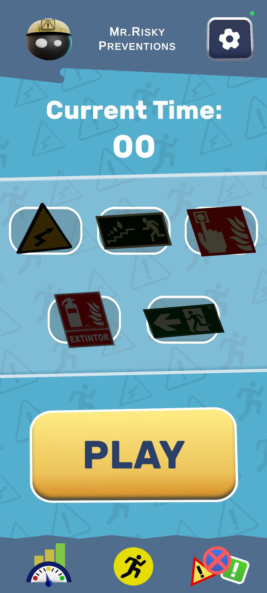
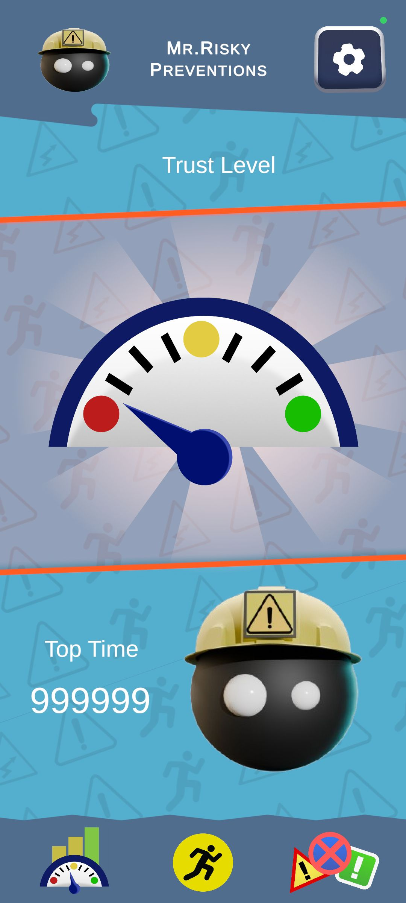
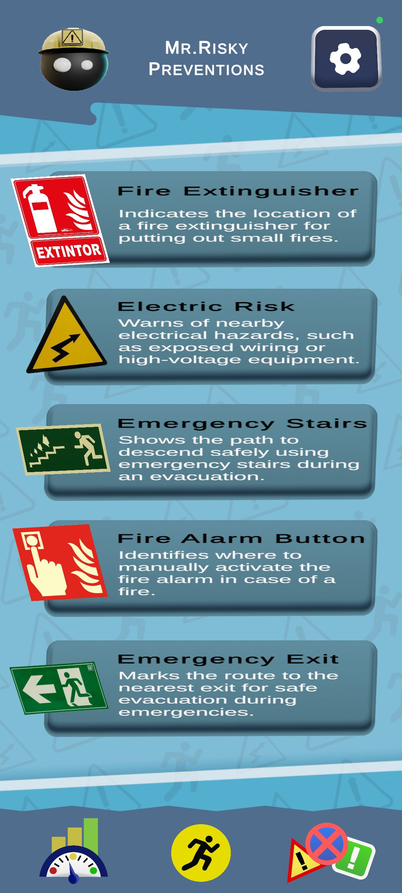
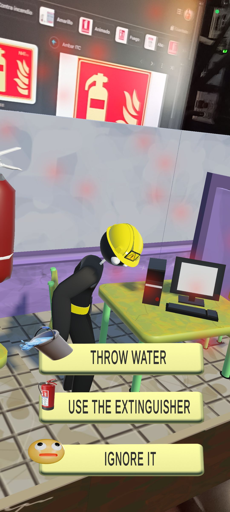
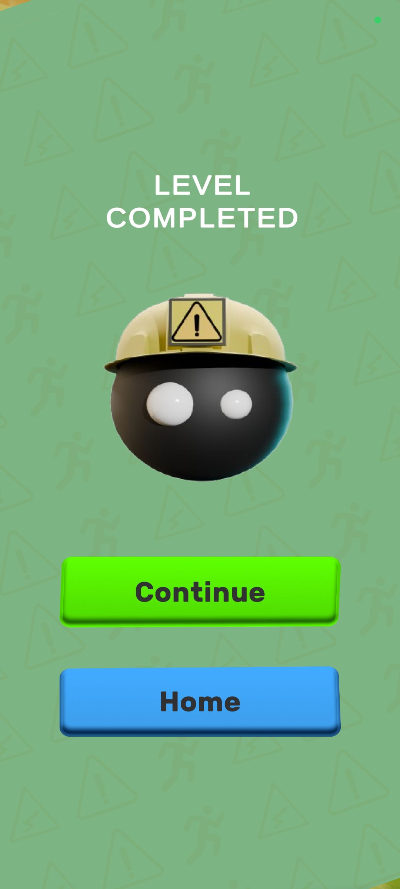
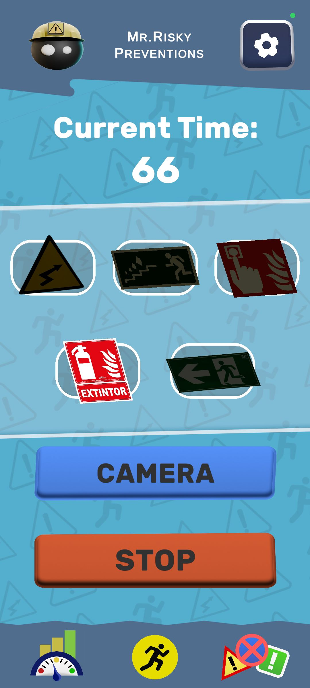

# MrRisky Preventions
 
## Resumen del juego
"Mr.Risky Preventions" es un juego de realidad aumentada (AR) en el que un
pequeño personaje adorable acompaña al jugador por diferentes espacios. El
objetivo es educar al usuario sobre los riesgos laborales a través de la interacción
con carteles de seguridad y minijuegos. A medida que el usuario escanea cada
cartel, el muñequito enfrenta una situación de peligro, y el jugador debe ayudarlo a
evitar el accidente tomando la decisión correcta. El progreso del jugador es visible
mediante una interfaz atractiva que muestra los niveles superados.

## Género
- Educativo / Aventura en Realidad Aumentada

## Plataforma
- Dispositivos móviles (Android) con soporte para AR
- Compatibilidad con gafas AR/VR para una experiencia más inmersiva
(opcional).

## Público objetivo
- Estudiantes de secundaria y empleados en formación laboral que deseen
aprender sobre seguridad laboral de una manera lúdica y entretenida.

## Desarrolladores
- Programación: [Adrián Ontiveros Cruz](https://github.com/AdriOntiC)
- Arte: [Pol Minguella Ayuso](https://github.com/PolMiAy04)

## Game Screenshots

  
  
  

  
  
  

